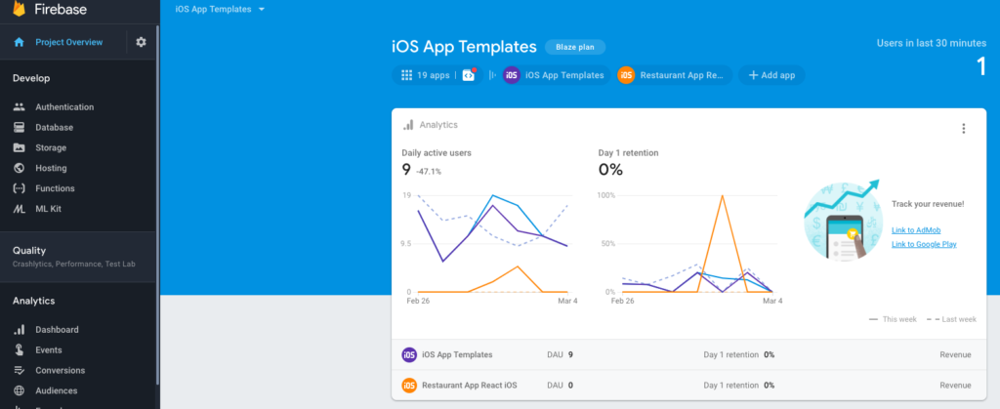
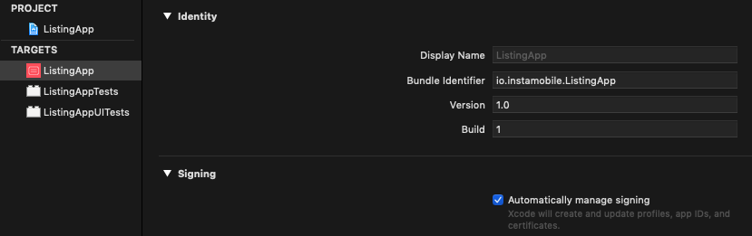
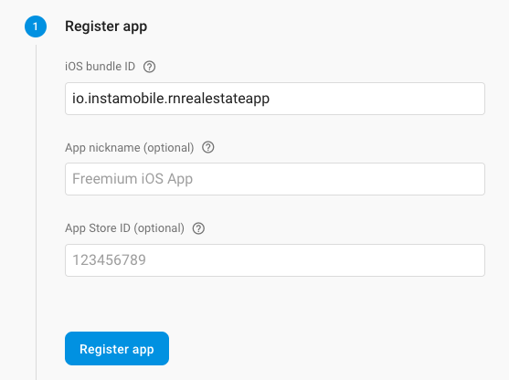

# Configure a Firebase Project  

Once you’ve created a Firebase account, you can host multiple Firebase Projects within it, that can host multiple mobile apps.
You need to create a mobile app project in Firebase for each app that you are planning to publish. If you are publishing to both iOS and Android, you will need to create two apps in Firebase, since technically they are different apps.
In the 

[Firebase Console](https://console.firebase.google.com/), let’s also create a new project and a new mobile app. If you want your Flutter app to run on both iOS and Android, then you need to create a different mobile app for each (in Firebase). Simply click on “
__Add App__”button. 

After you select the platform (
__iOS__ or __Android__ ), you need to provide the app’s identifier. Depending on which Flutter template you’ve purchased, it can be different. You can find the correct identifier in the files you’ve downloaded:

+ for __Android__, go to android/app/build.gradle and get the __applicationId__ (usually line 101)
+ for __iOS__, open the app in Xcode and locate the Bundle ID field in the project’s configuration:

Once you have the bundle ID, just use it in Firebase and create the app.

__Note__: Before you submit your app to the App Store or Google Play, you’ll need to update these bundle identifiers with your own unique identifiers, since the app stores don’t allow duplicate application ids.

