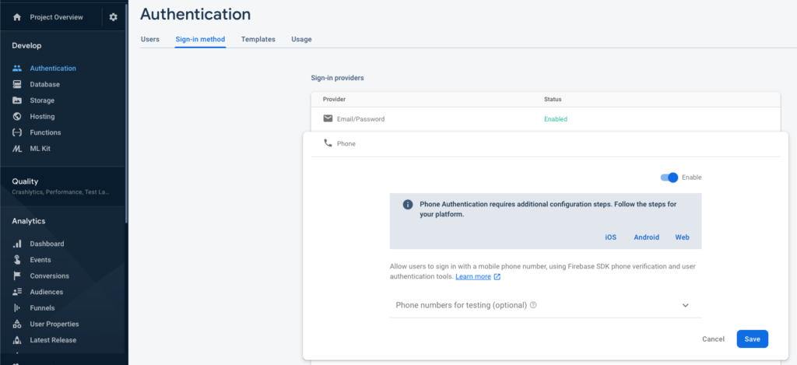
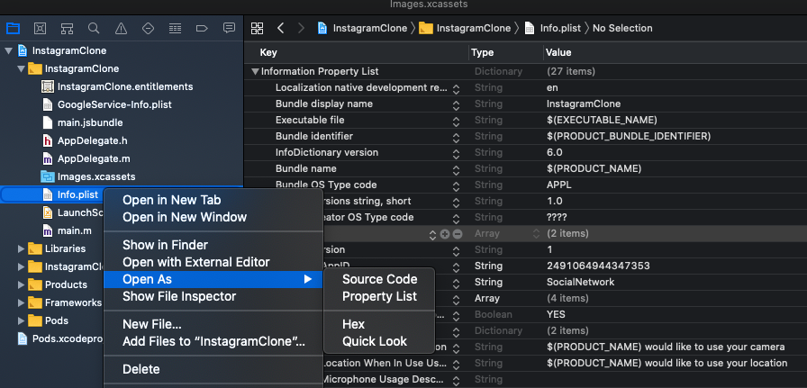
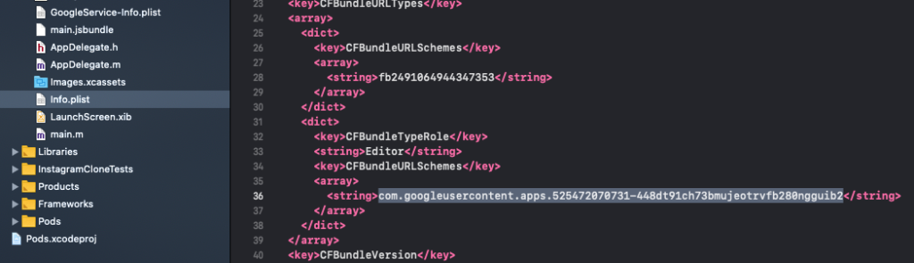
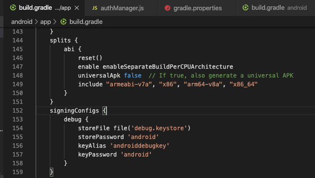
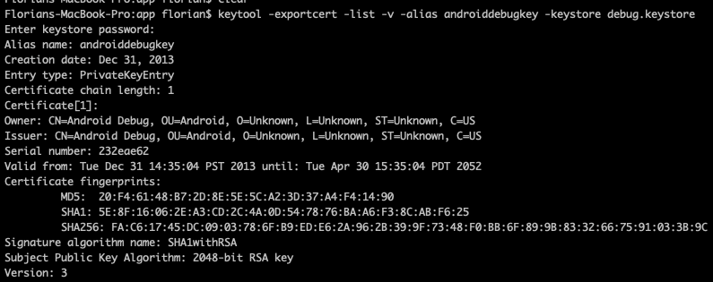
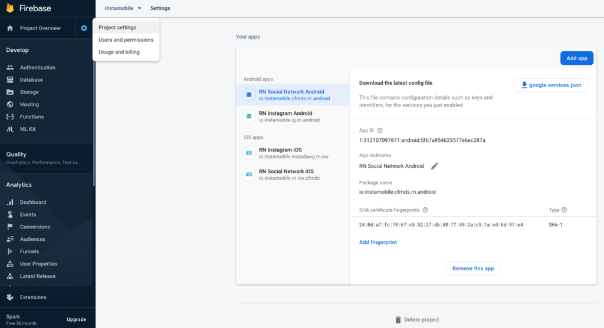

# Enable SMS Phone Authentication  

To enable SMS authentication with Firebase, there are a few things we need to configure, that will allow the app to send SMS to the users.

## Enable Phone Authentication in Firebase  

In Firebase, go to __Authentication__ ->  __Sign-in method__ -> __Phone Authentication__ and check the __Enable__ switch. 

  

## iOS Setup  
1. Open the  __GoogleService-Info.plist__ file in Xcode, and copy the __REVERSED_CLIENT_ID__ value to the clipboard

Make sure that this is your own file which you already downloaded from Firebase at the previous steps. The string will look like this:

```mdx
1. com.googleusercontent.apps.525472070731-448dt91ch73bmujeotrvfb280ngguib2
```
 2. In Xcode, select the __Info.plist__ file, __right click__ on it -> __Open As__ -> __Source Code__   




 3. In __Info.plist__ source code, under  __CFBundleURLSchemes__ paste the client ID string copied at the previous step (by replacing the existing one) 

  

 That’s it. Build and run the app again in Xcode, and now you’ll be able to see real SMS texts getting sent to any phone number.

## Android Setup  

For Android, setting up SMS Phone Authentication with Firebase is a slightly different than iOS.

__1. Generate an upload key keystore__

For MacOS, simply run the following command from the “android/app” folder of the Flutter project:

```mdx
1. keytool -genkeypair -v -keystore debug.keystore -alias androiddebugkey -keyalg RSA -keysize 2048 -validity 10000
```
 When asked for a __password__, just use __android__.

 This will work when running the app in debug mode.

For Windows users, you can generate a private signing key using __keytool__.  `keytool` must be run from `C:\Program Files\Java\jdkx.x.x_x\bin`.

If you are building the final app for production (Google Play publishing), follow the official [Flutter docs](https://docs.flutter.dev/deployment/android) 
 on how to generate a production signed binary.

If you are still in development mode, you can use the existing debug signing config that we’ve created for you already. You can see the configuration of this signing config in android/app/build.gradle file:


  

__2. Generate a SHA-1 fingerprint certificate from the keystore__

Simply run the following command (in __android/app__ folder). Use the password __android__  when prompted for it.
```mdx
1. keytool -exportcert -list -v -alias androiddebugkey -keystore debug.keystore
```

This will generate a SHA-1 fingerprint. Copy it to clipboard.

  

You can find more details in the [official documentation](https://developers.google.com/android/guides/client-auth) from Google if you run into any issues.

__3. Add the SHA-1 code to Firebase__

In Firebase, go to __Project Settings__ -> __Select the Android app__ -> __Add Fingerprint__ and place the SHA-1 fingerprint certificate in the corresponding field:

  

That’s it. Build and run the Android app again, and now you’ll be able to receive real SMS texts via Firebase.


