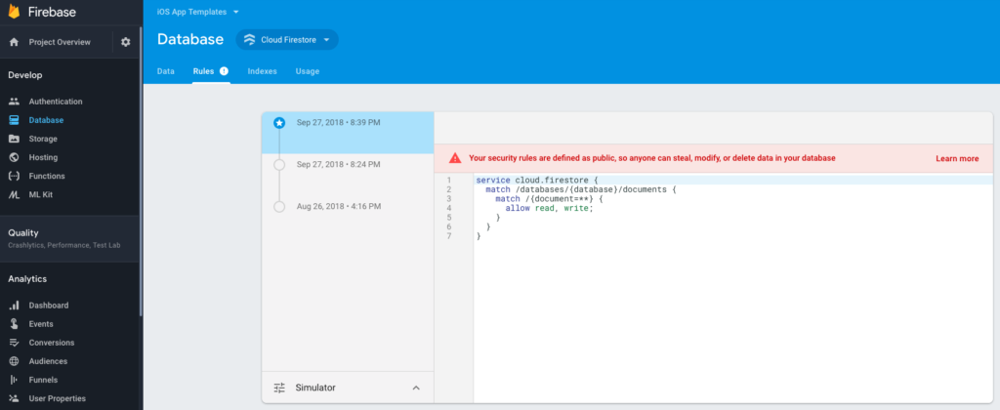

# Enable Firebase Firestore
In order to allow the mobile app to read and write data to/from Firebase Firestore, we need to set up the correct access permissions. To do that, just head over to Database -> Cloud Firestore and set the Rules for writes and reads to public.
```mdx
service cloud.firestore {
  match /databases/{database}/documents {
    match /{document=**} {
      allow read, write: if true;
    }
  }
}
```
