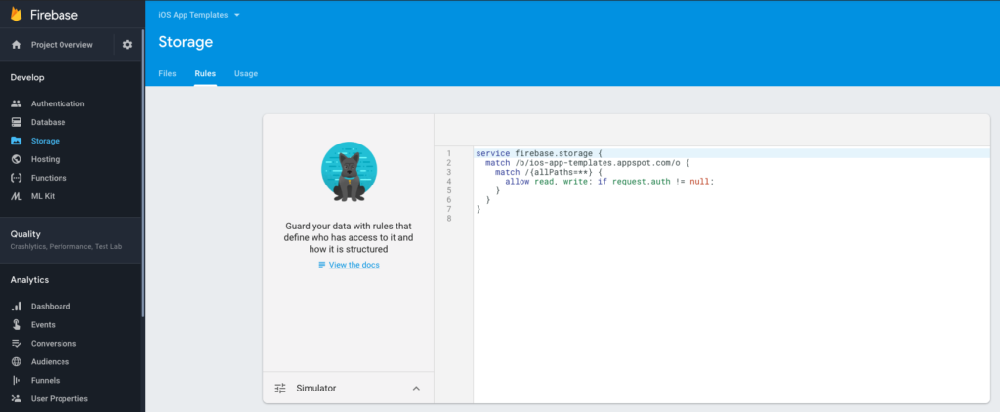

# Enable Firebase Storage
If your mobile app needs access to Firebase Storage (e.g. for uploading photos and videos, for instance), you have to enable Firebase Storage, so that the functionality works properly. To enable it, just go to Storage in the left menu. This is how your Storage rules need to look like in order for the app to function correctly:

```mdxservice firebase.storage {
  match /b/{bucket}/o {
    match /{allPaths=**} {
      allow read, write: if request.auth != null;
    }
  }
}
```  
