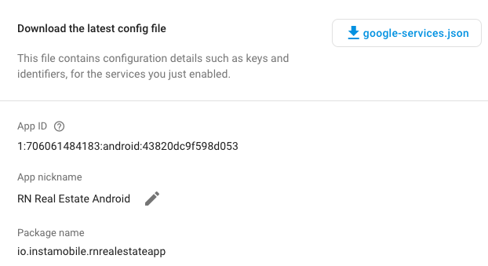

# Link Firebase Account to Your Mobile App  

Once you’ve created the app, Firebase will generate a configuration file for you. You will add this file in your Flutter app.

__This is how the Flutter app can use your own Firebase backend.__ 

This To do that, just download the configuration file and replace the existing mock files:

+ __iOS__: Download the __GoogleService-Info-plist__  file and override the existing __ios/NameOfApp/GoogleService-Info.plist__ file.
+ __Android__: Download the __google-service.json__  file and replace the existing __android/app/google-service.json__ file. 

If you already had an app in Firebase, you can find and download this configuration file in Firebase Console -> Project Settings.

  

That’s it. Now, when you run your brand new Flutter template, the mobile app will use your own Firebase backend, as opposed to our default one. Make sure you add all the tables and the required data in your Firebase so that the app will have items to display (e.g. food categories, chat messages, etc.). To quickly test the Flutter firebase integration, try registering a new user and see if they show up in __Firebase__  ->  __Authentication__ tab.