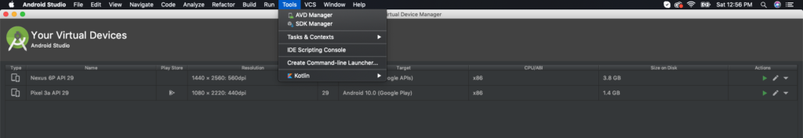
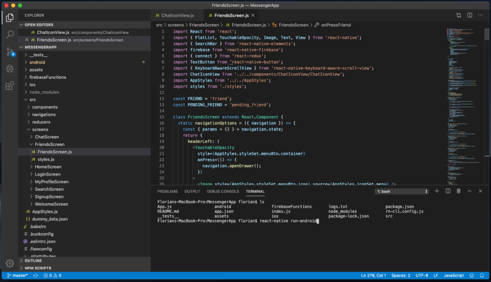
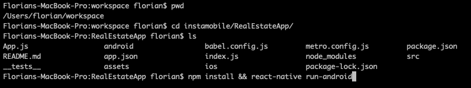

 # Running on Android
 To run our Flutter templates on Android, simply follow these steps, in order:

+ Plug in your Android device or open an emulator
+ Open a Terminal window and run:

```mdx 
1. cd ~/path/to/template  

2. flutter run
```

+ Replace ~/path/to/template with the correct path to the folder where you extracted the archive downloaded from our server. To make sure you are in the right folder, you can run “pwd” to see the current path. It must be the folder with the template, otherwise the app won’t run.  


If you are using Flutter >= 2.0 or Dart version >=2.12 with Null Safety you might want to replace this command

```mdx 
flutter run 
```
 with this one

```mdx 
flutter run --no-sound-null-safety 
```
 That’s all. The app is now running on your Android device. If you need more details or help, read on.

## Plug in an Android device or emulator  
 In order to run Flutter apps on Android, you need an Android device or an emulator. If you have an Android phone or tablet, simply plug it in. You might need to enable USB debugging in Device Settings, under Developer Tools. Follow the [official Android documentation](https://developer.android.com/studio/run/device) if you run into any issues. Android emulators are bundled into __Android Studio__,
 so please [install Android Studio](https://developer.android.com/studio), open it, go to __Tools__ -> __AVD Manager__ and start an emulator of your choosing:react native android emulator. 

   

You can also create new emulators of your own, with your own hardware requirements. Once you have an emulator up and running, proceed to the next step. 

## Run the Flutter App
__MacOS__ / __UNIX All__ 
you need to do is simply run the two commands we described above: 
```mdx 
1. cd ~/path/to/template  
  
2. flutter run
```
If you are using Flutter >= 2.0 or Dart version >=2.12 with Null Safety you might want to replace this command 

 with this one
```mdx 
 flutter run --no-sound-null-safety 
```
 Alternatively, you can also use Visual Studio Code, which gives you a Terminal that’s directly located at the right folder. In that case, you can simply run “flutter run” and the app will just start. __Windows users__ The command prompt on Windows is weird, so don’t use it. Instead, please install [Visual Studio Code](https://code.visualstudio.com/), which has a built-in Terminal that behaves exactly like the terminal on MacOS. Go to __View -> Terminal__ to activate the __Terminal__: visual studio code terminal.



Please make sure you find the correct path of the folder where the template resides. Here’s an example of a commands sequence you can use as an example to locate the correct folder:react native terminal. 




## Note:
 If you are using Flutter >= 2.0 or Dart version >=2.12 with Null Safety you might want to replace this command 

```mdx 
flutter run
```
```mdx 
flutter run --no-sound-null-safety
```

