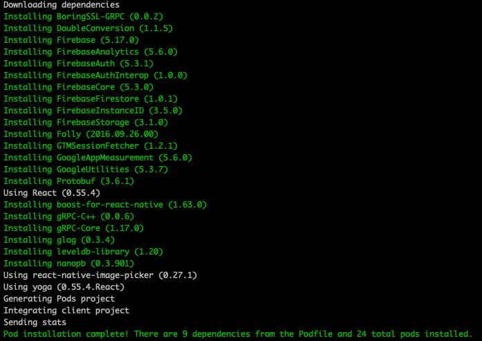
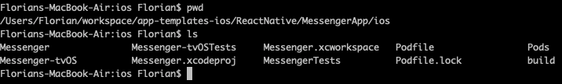
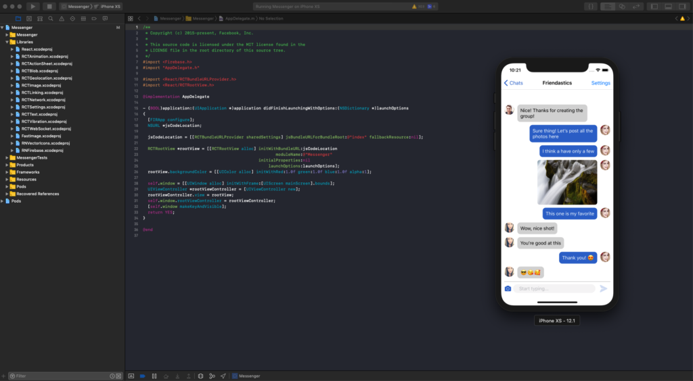

# Running on iOS

In this section, we are describing the steps that you need to do in order to run our Flutter app templates on iOS, from setting up the environment to building the project in Xcode.

To run a Flutter app on iOS, you need Mac OS and Xcode, but there’s no need for an Apple developer account or an iPhone – you can simply run any Xcode project on the iOS simulator.

If you are not new to iOS / Flutter development, and you already have the dev environment set up, simply do the following steps:

+  Be absolutely sure you have  __the latest STABLE Xcode version__
(DO NOT USE XCODE BETA) 
+  Run __“flutter run”__ in the root folder of the downloaded project:

```mdx 
flutter run
```
__Note that if you are using Flutter >= 2.0 or Dart version >=2.12 with Null Safety you might want to run:__

```mdx 
flutter run --no-sound-null-safety
```
+  If the project did not start, open the __.xcworkspace__ 
     file in Xcode, which got generated at the previous step (you can find it in the  
               __ios__ 
                folder). Also make sure a 
                 __Pods__
                  folder got generated, otherwise the build won’t work.
+  In Xcode, select the iOS simulator / device and build and run the app (
       __Command__ + __R__)

If this is the first time you are running an iOS project on your machine, you need to set up your environment first. We recommend you to follow the official [Flutter documentation](https://docs.flutter.dev/get-started/test-drive?tab=vscode) first, on how to run Flutter apps.

There are a few prerequisites that are iOS specific (you don’t need them for Android):

+  [Xcode](https://developer.apple.com/xcode/)
+  Install [CocoaPods](https://cocoapods.org/) 
+  Install [Flutter](https://flutter.dev/)

We’re assuming you already have the environment to run Flutter apps.
Follow the next quick steps to get your app running on an iOS device or iOS simulator.
 
 ## 1. Run “flutter run” in the project root directory  
if the “flutter run” command fails, you might want to run :

```mdx
 flutter run --no-sound-null-safety
```
## 2. Locate the ios folder and run “pod update“  

    This will install all the pods that the Flutter app depends on, such as Firebase Auth, Storage, etc. Make sure you have Cocoapods installed beforehand. Here’s how a successful output looks like:

  

This will also generate a .xcworkspace file, that can be opened in Xcode.



## 3. Open the .xcworkspace file in Xcode  

Simply double click on the file in the terminal (make sure you are in the ios folder).


## 4. Run Xcode project  

Choose a simulator or device in Xcode then go to Product -> Run, or simply press Command + R. This will build and run the chat project in the selected device/simulator.
  
  


