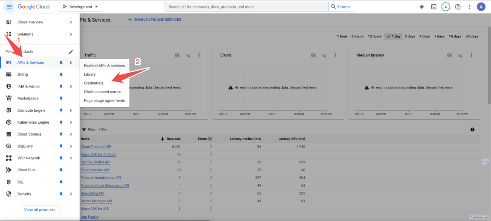
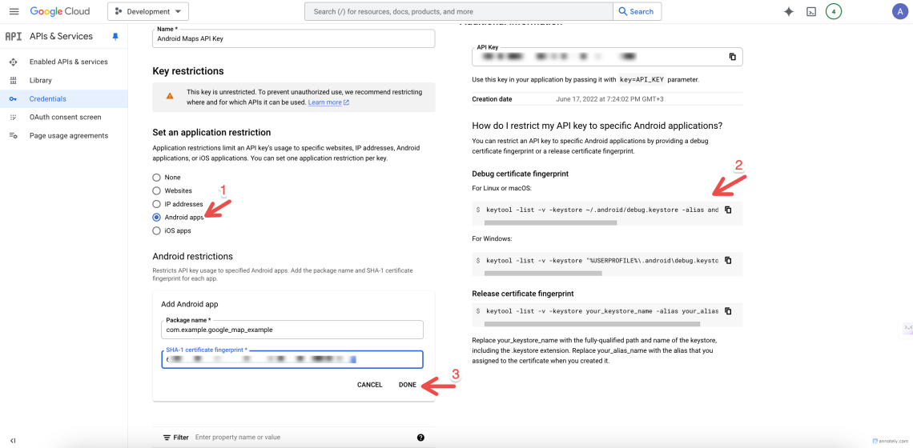

import Note from "@theme/Admonition";
import Tabs from "@theme/Tabs";
import TabItem from "@theme/TabItem";
import Admonition from "@theme/Admonition";

# How to Add Maps in Flutter Apps

<Note title="Prerequisites">
  This tutorial assumes you have Flutter set up on your computer. Run the
  command <code>flutter doctor</code> to check your setup.
</Note>

Displaying maps is a core functionality of many mobile apps – Google Maps, Yelp, Foursquare, Uber, Snapchat, UberEats, etc – all popular apps have certain map features. Let’s see how we can implement maps in a Flutter app to create interactive and playful user experiences.

The Flutter ecosystem is flourishing and will definitely make a huge mark in the near future as one of the most established cross-platform mobile application development frameworks. The community is rapidly growing, and there are already many powerful libraries available.

In this tutorial, we are going to make use of the [`google_maps_flutter`](https://pub.dev/packages/google_maps_flutter) package to display maps in our Flutter apps.

## Integrating Google Maps in Flutter Apps

Maps are used in applications that deal with navigation and delivery such as Yelp or UberEats, shopping applications, geolocation apps, etc. We can use it to show locations, track locations, real-time navigation, etc. In this tutorial, we are going to use the Google Maps API from the Google Developer Console. The idea is to integrate the Google API key equipped with Android Google map SDK to our Flutter project. Then, we will use the mentioned package to show the map on the app screen. We will also work with markers and their customizations. So, let’s get started!

### Create a New Flutter Project

First, we need to create a new Flutter project. For that, make sure that the Flutter SDK and other Flutter app development-related requirements are properly installed. If everything is properly set up, then in order to create a project, we can simply run the following command in the desired local directory:

```mdx
flutter create google_map_example
```

After the project has been set up, we can navigate inside the project directory and execute the following command in the terminal to run the project in either an available emulator or an actual device:

```mdx
flutter run
```

### Scaffolding the Flutter Project

Now, we need to replace the default template with our own project structure template.

1. Create a folder called `./screens` inside the `./lib` folder.

2. Inside the `./lib/screens` folder, create a new file called `home.dart`.

3. Implement a simple Stateful widget class in `home.dart` that returns a Scaffold widget with a basic App bar and an empty Container body.

The code for home.dart is shown in the code snippet below:

```dart
import 'package:flutter/material.dart';

class HomePage extends StatefulWidget {
  const HomePage({super.key});

  @override
  State<HomePage> createState() => _HomePageState();
}

class _HomePageState extends State<HomePage> {
  @override
  Widget build(BuildContext context) {
    return Scaffold(
      appBar: AppBar(
        title: const Text("Maps"),
        centerTitle: true,
      ),
      body: const Center(
        child: Text("Maps"),
      ),
    );
  }
}

```

Now, we need to replace the default template in the `main.dart` file and call the **HomePage** screen in the home option of _MaterialApp_ widget as shown in the code snippet below

```dart
import 'package:flutter/material.dart';
import 'package:google_map_example/screens/home.dart';
void main() {
  runApp(const MyApp());
}
class MyApp extends StatelessWidget {
  const MyApp({super.key});

  @override
  Widget build(BuildContext context) {
    return MaterialApp(
      title: 'Flutter Demo',
      debugShowCheckedModeBanner: false,
      theme: ThemeData(
        primarySwatch: Colors.blue,
        visualDensity: VisualDensity.adaptivePlatformDensity,
      ),
      home: const HomePage(),
    );
  }
}
```

At this point, we will get the following result in the emulator screen:


### Getting The API Key for Google Maps

Now, we need the API key for Google Maps in order to access the map in our application. The process to get the API key is easy. We need to go on and login to [`Google Developer Console`](https://console.cloud.google.com/apis). In the developer console, we need to create a project if we don’t have one already, Next we navigate to [`Maps platform`](https://cloud.google.com/maps-platform). Click with the `Get started`

:::info
You will need to pass company or individual details, address, and details of your credit card.
:::

Next, Return to Google Cloud platform and navigate to `APIs and Services`



### Restrict your API key

In the window that follows you should see a row labeled _Maps API Key_ under `API Keys`. Select it.

:::warning

It is recommended to restrict your key to prevent unauthorized use of it, especially in production.
It is also best recommended to use separate API key for each platforms of your application, as each API Key can be restricted to just one Android package name or ios bundle identifier or web domain.
:::

You can restrict it for android platform using the below steps:



### Adding the API Key to our Flutter App

<Tabs>
  <TabItem value="android" label="Android" default>
   In order to add the Android Maps API key to the Flutter project, we need to first go to the **AndroidManifest.xm** file. In our `android/app/src/main/AndroidManifest.xml` file, we need to add the following code as a child of the application element:

```xml
<manifest ...>
  <application ...>
    <meta-data android:name="com.google.android.geo.API_KEY"
               android:value="YOUR KEY HERE"/>
  </application>
</manifest>
```
Here, we need to replace the value in android:value with the API key that we generated in the above steps. Make sure you use your own API key.
  </TabItem>
  <TabItem value="ios" label="IOS">

Specify your API key in the application delegate `ios/Runner/AppDelegate.swift`:

```dart
import Flutter
import UIKit
import GoogleMaps

@main
@objc class AppDelegate: FlutterAppDelegate {
  override func application(
    _ application: UIApplication,
    didFinishLaunchingWithOptions launchOptions: [UIApplication.LaunchOptionsKey: Any]?
  ) -> Bool {
    GMSServices.provideAPIKey("YOUR KEY HERE")
    GeneratedPluginRegistrant.register(with: self)
    return super.application(application, didFinishLaunchingWithOptions: launchOptions)
  }
}

```

  </TabItem>

</Tabs>


### Installing Google Maps Flutter Plugin

Now, we are going to use the package called google_maps_flutter. This plugin provides the GoogleMap widget to be used in our Flutter project to show the map on the screen.
The widget houses many properties that allow us to tamper with the displayed map and customize it accordingly. Now, to install this plugin, add this to your project by heading to pubspec.yaml and running flutter pub get :

```yaml
dependencies:
  flutter:
    sdk: flutter
  google_maps_flutter: 2.9.0
```

### Adding Maps to The Home Screen

Now, we are going to add the GoogleMap widget to our Home screen to display the map on the screen.
For this, we need to initialize the GoogleMapController that handles the loading state of the map.
Then, we need to define the CameraPosition that determines which location the map has to show in.
In CameraPosition class, we can assign the target value which is latitude and longitude.
We can also specify the zoom value which will determine how much the camera is to be zoomed into the map.
Then, we need to use the GoogleMap widget with all the required properties configured as shown in the code snippet below:

```dart
import 'dart:async';
import 'package:flutter/material.dart';
import 'package:google_maps_flutter/google_maps_flutter.dart';

class HomePage extends StatefulWidget {
  const HomePage({super.key});

  @override
  State<HomePage> createState() => _HomePageState();
}

class _HomePageState extends State<HomePage> {
  final Completer<GoogleMapController> _controller = Completer();
  static const CameraPosition _initialCameraPosition = CameraPosition(
    target: LatLng(37.42796133580664, -122.085749655962),
    zoom: 15,
  );

  @override
  Widget build(BuildContext context) {
    return Scaffold(
      appBar: AppBar(
        title: const Text("Maps"),
        centerTitle: true,
      ),
      body: GoogleMap(
        mapType: MapType.normal,
        initialCameraPosition: _initialCameraPosition,
        onMapCreated: (GoogleMapController controller) {
          _controller.complete(controller);
        },
      ),
    );
  }
}
```

Here, using the mapType option on the GoogleMap widget, we can choose what type of map to show.
It can be a satellite image, a roadmap, or a normal map.
The onMapCreated event will be created after the map has been placed on the screen.
In this event, we can choose to add the map markers which we are going to do later.
The image is shown in the screenshot below:


### Adding Map Markers

Now, we are going to add a marker to our map. T
he markers help us show a specific location on the map.
In order to set the markers, we need to initialize a state that holds the markers.
Then, we are going to create a function that will be triggered in the onMapCreated event.
After the map is created, we will add the markers to the screen.
To add markers, we have access to the Marker widget which will take a markerId and position value (latitude and longitude).
The markers initialization is provided in the code snippet below:

```dart
 Set<Marker> _markers = {};
  void _onMapCreated (GoogleMapController controller) {
    setState(() {
      _markers.add(
          const Marker(
              markerId: MarkerId("id-1"),
              position: LatLng(37.42796133580664, -122.085749655962),
          )
      );
    });
  }

```

Now, we need to set the `markers` property in the `GoogleMap` widget and also assign the `_onMapCreated` function in the `onMapCreated` event as shown in the code snippet below:

```dart
 body: GoogleMap(
        mapType: MapType.normal,
        initialCameraPosition: _initialCameraPosition,
        onMapCreated: _onMapCreated,
        markers: _markers,
      ),
```

Hence, we will get the marker on the map as shown in the screenshot below


### Adding Info to The Map Markers

We can also customize our markers based on our own needs. We can add information to it as well. The information will be shown once we click on the marker on the map. In order to add the marker info, we need to add the `infoWindow` property to the `Marker` widget. Then, we need to use the `InfoWindow` widget to add extra information to the marker as shown in the code snippet below:

```dart
  void _onMapCreated (GoogleMapController controller) {
    setState(() {
      _markers.add(
          const Marker(
              markerId: MarkerId("id-1"),
              position: LatLng(37.42796133580664, -122.085749655962),
              infoWindow: InfoWindow(
                  title: "GooglePlex"
              )
          )
      );
    });
  }
```

Now once we click on the marker, we will see the information as shown in the screenshot below:


Not only that, we can add custom icons and other elements to the marker which is pretty easy as well. Finally, we have successfully integrated Google Maps into our Flutter map project using Google Maps SDK API key from Google Developer Console and `google_maps_flutter` package.

### Our Products Using Google Maps

The following products from InstaFlutter leverage Google Maps:


#### 1. 🚗🛒 Flutter Multivendor Consumer and Driver app

#### 2. 🏠🔍 Flutter Real Estate app

#### 3. 🏪🗺️ Flutter Store Locator app

#### 4. 📋🏘️ Flutter Ulisting app

<Admonition type="tip" title="tip">

  **Configuring** `flutter_google_places_hoc081098`

  To configure the flutter_google_places_hoc081098 package in your project:

  - Head to *lib/constants.dart* in your project and modify the line

  ```dart
  const googleApiKey = 'YOUR KEY HERE';
  ```
</Admonition>

### Conclusion

The main objective of this Flutter tutorial is to explore the integration of Google Maps in the Flutter environment. Google Maps is a powerful geo-navigation service provided by Google which can be integrated into almost any technology nowadays. In this case, we made use of Google API restricted to Android Google Maps SDK to integrate Google Maps into our Flutter project. Then, in order to show the actual map on the UI of the mobile app, we made use of the latest package available which is `google_maps_flutter`. The configurations were easy and simple. The map was set up with the help of a simple `GoogleMap` widget and some basic configurations. In the end, we were also able to add some markers to the map. A lot of other things are possible with this widget which is a challenge for you to explore.
Looking to build something similar but in React Native? Check out this stunning [`Uber clone`](https://instamobile.io/uber-clone/).

---

If you found this tutorial on how to add maps to Flutter apps, please consider spreading the word, by sharing the link further. Cheers!

