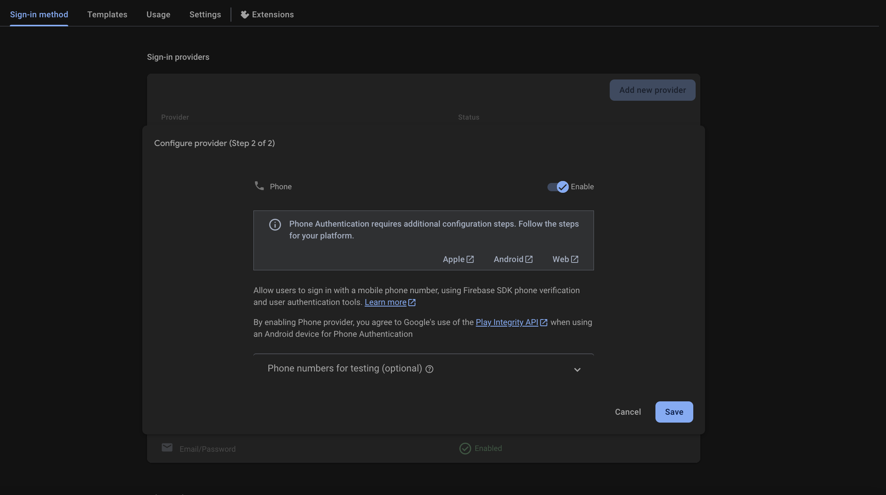

import Note from "@theme/Admonition";
import Admonition from "@theme/Admonition";

# Flutter Phone Auth with Firebase

## Introduction

Secure and relevant data can only be shown to users who have been authenticated by a mobile application. Firebase, a backend service, offers User authentication along with other important backend services, such as Google Drive. To utilize the Firebase User Authentication Backend Service, you'll need to link Firebase with your application.

## Understanding Firebase Authentication

Firebase Authentication provides multiple methods to verify or authenticate user identity:
- Email and password
- Phone number verification
- Other authentication providers

This guide focuses specifically on mobile phone verification. The process involves:
1. Sending OTP Code (One Time Password) to user's device
2. Firebase automatically retrieving the code OR
3. Manual code entry by user (if auto retrieval fails)

:::tip Before You Start
Ensure you've created a Firebase project and integrated it with your application before proceeding with the implementation. And make sure your project is on the `Blaze Plan` (pay-as-you-go). Lastly checkout the first <a href="./implementing-firebase-authentication-in-flutter">tip</a> to add firebase dependecies.
:::

## Setup Process

### Activate Phone Authentication

Once you’ve created a Firebase project in the Firebase interface and integrated it with Flutter, you must activate the phone sign-up method first before you can use it. To do this, open the Authentication tab on the left side of the Firebase interface. Enable phone verification by clicking the Setup Signup method.




Open the pubspec.yaml file and make sure that the Firebase Authentication and Firebase Core plugins have been added to the list.

```yaml
dependencies:
  firebase_auth: 5.3.1 
  firebase_core: 3.6.0
```

## Implementation Guide

That is really exciting news! Let’s begin by discussing the user interface of the program (UI). The app would only need to feature two screens, the Login Screen and the Home Screen, in order for the user to be able to log in. Once the user’s identity has been verified, the Home Screen will be shown.

:::note Registration Process
When a user makes their first use of Mobile verification, Firebase automatically registers that user in the authentication data. However, when a user does not make their first use of Mobile verification, Firebase merely verifies the user by sending a message to the user. This raises the question of where the registration screen might be located. The code for the home screen and the login screen is provided below.
:::

### Code Implementation

<details>
<summary><b>Login Screen Implementation - `login_screen.dart`</b></summary>
```dart
import 'package:flutter/material.dart';

class LoginScreen extends StatelessWidget {
  final _phoneController = TextEditingController();
  final _passController = TextEditingController();
  final _codeController = TextEditingController();

  LoginScreen({super.key});

  //Place A

  @override
  Widget build(BuildContext context) {
    return Scaffold(
      body: Container(
        padding: EdgeInsets.all(32),
        child: Form(
          child: Column(
            crossAxisAlignment: CrossAxisAlignment.start,
            mainAxisAlignment: MainAxisAlignment.center,
            children: <Widget>[
              const Text(
                "Login",
                style: TextStyle(
                  color: Colors.lightBlue,
                  fontSize: 36,
                  fontWeight: FontWeight.w500,
                ),
              ),
              const SizedBox(height: 16),
              TextFormField(
                decoration: InputDecoration(
                  enabledBorder: OutlineInputBorder(
                    borderRadius: const BorderRadius.all(Radius.circular(8)),
                    borderSide: BorderSide(color: Colors.grey[200]!),
                  ),
                  focusedBorder: OutlineInputBorder(
                    borderRadius: const BorderRadius.all(Radius.circular(8)),
                    borderSide: BorderSide(color: Colors.grey[300]!),
                  ),
                  filled: true,
                  fillColor: Colors.grey[100],
                  hintText: "Phone Number",
                ),
                controller: _phoneController,
              ),
              const SizedBox(height: 16),
              TextFormField(
                decoration: InputDecoration(
                  enabledBorder: OutlineInputBorder(
                    borderRadius: const BorderRadius.all(Radius.circular(8)),
                    borderSide: BorderSide(color: Colors.grey[200]!),
                  ),
                  focusedBorder: OutlineInputBorder(
                    borderRadius: const BorderRadius.all(Radius.circular(8)),
                    borderSide: BorderSide(color: Colors.grey[300]!),
                  ),
                  filled: true,
                  fillColor: Colors.grey[100],
                  hintText: "Password",
                ),
                obscureText: true,
                controller: _passController,
              ),
             const  SizedBox(height: 16),
              SizedBox(
                width: double.infinity,
                child: ElevatedButton(
                  style: ElevatedButton.styleFrom(
                    backgroundColor: Colors.blue,
                    padding: const  EdgeInsets.all(16),
                    textStyle: const TextStyle(color: Colors.white),
                  ),
                  onPressed: () {
                    // Place B
                  },
                  child: const Text("Login"),
                ),
              ),
            ],
          ),
        ),
      ),
    );
  }
}
```

</details>

<details>
<summary><b>Home Screen Implementation - `home_screen.dart`</b></summary>
```dart
import 'package:firebase_auth/firebase_auth.dart';
import 'package:flutter/material.dart';

class HomeScreen extends StatelessWidget {
  final User? user;

  const HomeScreen({super.key, required this.user});

  @override
  Widget build(BuildContext context) {
    return Scaffold(
      body: Container(
        padding: const EdgeInsets.all(32),
        child: Column(
          mainAxisAlignment: MainAxisAlignment.center,
          crossAxisAlignment: CrossAxisAlignment.start,
          children: <Widget>[
           const Text(
              "You are Logged in successfully",
              style: TextStyle(
                color: Colors.lightBlue,
                fontSize: 32,
              ),
            ),
            const SizedBox(height: 16),
            Text(
              "${user?.phoneNumber}",
              style: const TextStyle(
                color: Colors.grey,
              ),
            ),
          ],
        ),
      ),
    );
  }
}

```

</details>


<details>
<summary><b> `main.dart`</b></summary>
```dart
import 'package:firebase_core/firebase_core.dart';
import 'package:flutter/material.dart';
import 'package:flutter_phone_auth/login_screen.dart';

void main() async {
  WidgetsFlutterBinding.ensureInitialized();
  await Firebase.initializeApp();
  runApp(const MyApp());
}

class MyApp extends StatelessWidget {
  const MyApp({super.key});

  @override
  Widget build(BuildContext context) {
    return MaterialApp(
      title: 'Flutter Demo',
      theme: ThemeData(
        colorScheme: ColorScheme.fromSeed(seedColor: Colors.deepPurple),
        useMaterial3: true,
      ),
      home: LoginScreen(),
    );
  }
}

```
</details>
Now that we’ve finished with the user interface (UI) element, we can go on to the major item, which is verifying users based on the mobile phone numbers they provide.

Create a Future that may be used to validate the user’s credentials inside the LoginScreen class located at Place A.

```dart
Future registerUser(String mobile, BuildContext context) async{
//code
}
```
Now let’s begin by establishing the instance of Firebase auth that will be included inside the Future.

```dart
Future registerUser(String mobile, BuildContext context) async{
  FirebaseAuth _auth = FirebaseAuth.instance;
  }
```

Verifying a user’s identity using their cell phone is now possible thanks to a new feature offered by Firebase Authentication called verifyPhoneNumber.

```dart
 Future<void> registerUser(String mobile, BuildContext context) async {
    FirebaseAuth _auth = FirebaseAuth.instance;

    _auth.verifyPhoneNumber(
      phoneNumber: mobile,
      timeout: const Duration(seconds: 60),
      verificationCompleted: (PhoneAuthCredential credential) async {
          print("Verification for : ${credential}");
      },
      verificationFailed: (FirebaseAuthException e) {
        print("Verification failed: ${e.message}");
      },
      codeSent: (String verificationId, int? resendToken) {
        // Save the verification ID for later use
        print("Code sent to $mobile");
      },
      codeAutoRetrievalTimeout: (String verificationId) {
        // Handle code auto retrieval timeout
        print("Auto retrieval timeout");
      },
    );
  }
``` 
In the `verifyPhoneNumber`, the phoneNumber is the user’s mobile phone number, and timeout is the amount of time before the verification code given to the device expires (in seconds). Once the verification has been performed successfully, a call to verficationCompleted will be received in the callback. It’s possible for the verification to fail because of an invalid code or phone number. code Sent is a callback that gets called once the code is sent to the device. The last callback to be aware of is `codeAutoRetrievalTimeout`, which is triggered when the timer for automatic code retrieval expires.

To sign in, utilize the authCredential object that is returned in this callback. You must use the `signInWithCredential` Future offered by Firebase Authentication in order to sign in using authCredential.

```dart
verificationCompleted: (AuthCredential credential) {
  _auth.signInWithCredential(credential).then((UserCredential result) {
    Navigator.pushReplacement(context, MaterialPageRoute(
      builder: (context) => HomeScreen(user: result.user),
    ));
  }).catchError((e) {
    print(e);
  });
},
```

Next, let’s begin by defining the callback for codeSent. As previously indicated, auto retrieval may not function properly on certain devices. So we need to manually ask the user to enter the code he got on the device by displaying some dialog in codeSent, and then we need to manually construct the AuthCredential object that we received in the verificationCompleted callback from Firebase .

:::tip
The verification id issued by Firebase for each code, which you get in the codeSent from Firebase, and the OTP Code received by the user is required to create the AuthCredential. As a result, we may display a dialog box for the user to enter their OTP Code.
:::

```dart

codeSent: (String verificationId, [int? forceResendingToken]) {
  showDialog(
    context: context,
    barrierDismissible: false,
    builder: (context) => AlertDialog(
      title: const Text("Enter SMS Code"),
      content: Column(
        mainAxisSize: MainAxisSize.min,
        children: <Widget>[
          TextField(
            controller: _codeController,
          ),
        ],
      ),
      actions: <Widget>[
        TextButton(
          style: TextButton.styleFrom(
            foregroundColor: Colors.white,
            backgroundColor: Colors.redAccent,
          ),
          onPressed: () async {
            final auth = FirebaseAuth.instance;
            final smsCode = _codeController.text.trim();
            final credential = PhoneAuthProvider.credential(
              verificationId: verificationId,
              smsCode: smsCode,
            );

            try {
              final result = await auth.signInWithCredential(credential);
              Navigator.pushReplacement(
                context,
                MaterialPageRoute(builder: (context) => HomeScreen(user: result.user!)),
              );
            } catch (e) {
              print(e);
            }
          },
          child: const Text("Done"),
        ),
      ],
    ),
  );
},
```

:::important
To create an AuthCredential using the verification code and the one-time password that the user got, we used the code below.

```dart
PhoneAuthProvider.getCredential(verificationId: verificationId, smsCode: smsCode);
```

:::


Our Future for user registration or login has been completed, and now we need to call it in our Login Screen at Place B when the FlatButton onPressed is pressed.

```dart
SizedBox(
  width: double.infinity,
  child: ElevatedButton(
    style: ElevatedButton.styleFrom(
      backgroundColor: Colors.blue,
      padding: const EdgeInsets.all(16),
      textStyle: const TextStyle(color: Colors.white),
    ),
    onPressed: () {
      final mobile = _phoneController.text.trim();
      registerUser(mobile, context);
    },
    child: const Text("Login"),
  ),
),
//...

```
…and thus we are done!

That’s merely a mobile-specific version of User’s Authentication underlying.NET functionality. Adding basic validation and storing extra information like the display name and display picture with the user would improve the experience.

Thanks.