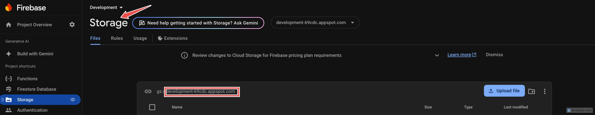

import Note from "@theme/Admonition";
import Tabs from "@theme/Tabs";
import TabItem from "@theme/TabItem";

# How to deploy your firebase functions

<Note title="Prerequisites">
  The prerequisite for this tutorial is you have done the firebase integration
  following the steps provided
  <a href="../firebase-integration/create-a-firebase-account">here</a>
</Note>

## Introduction

Imagine having the power to supercharge your app with backend capabilities without the hassle of managing servers. But it gets even better, you can run your code in a secure, managed environment, easily connect with other Firebase and Google Cloud services. All with just a few lines of code. Welcome to the world of Firebase functions! In today's fast-paced development landscape, the ability to quickly deploy server-side logic without the hassle of managing servers is nothing short of magical. Whether you're a solo developer working on a passion project or part of a team building the next big thing, Firebase Functions offers a gateway to serverless computing that can elevate your project's potential.

In this tutorial, we’re going to embark on an exciting journey where you’ll learn how to deploy Firebase functions and unlock a new level of functionality for your app. Firebase functions are a powerful feature of Firebase that allow you to run backend code in response to events triggered by Firebase features and HTTPS requests. They enable you to extend your app’s functionality without managing your own servers. Pretty cool!

## Getting Started

### Setting Up Your Environment

Before we dive into writing and deploying Firebase functions, we need to set up our development environment. This involves installing the necessary tools and configuring your project.

Make sure you have the following installed on your machine:

- **Node.js**: Firebase functions run on Node.js, so you'll need to have it installed. You can download it from [nodejs.org](https://nodejs.org). Run <code>node -v</code> on terminal to check your setup.
- **Firebase CLI**: This command-line tool allows you to interact with Firebase services from your terminal.

You can install it Firebase CLI globally using.

<Tabs>
  <TabItem value="npm" label="npm" default>

To install Firebase CLI using **npm**, run the following command in your terminal:

```mdx
npm install -g firebase-tools
```

</TabItem> <TabItem value="yarn" label="yarn">
To install Firebase CLI using Yarn, run the following command in your terminal:

```mdx
yarn global add firebase-tools
```

</TabItem>

</Tabs>

### Initializing Your Firebase Project

1. After installing the Firebase CLI, log in to your Firebase account by running:

```mdx
firebase login
```

This command will open a browser window where you can log in to your Firebase account. Once logged in, you can close the browser window and return to your terminal where you should see a success confirmation.

2. Next, navigate to the directory where you want to create your Firebase project. I have created a directory named `my-firebase-project` in my desktop, and run:

```mdx
firebase init
```

You’ll be prompted to select the Firebase features you want to set up. Use the arrow keys to navigate and the spacebar to select the following options :

- Functions: To set up Cloud Functions for Firebase.

Follow the prompts to configure your project. You’ll be asked to select an existing Firebase project or create a new one.The CLI gives you these options for language support: **JavaScript**, **TypeScript**, and **Python**. Choose your preferred option and proceed. 
:::note
If you plan to use the firebase functions provided provided by our team. You should choose **JavaScript**.
:::

3. Once the initialization is complete, Firebase will create a functions directory in your project. If you haven't installed the dependencies yet, do so by navigate to this directory:

```mdx
cd functions

npm install
```

This command installs the Firebase Functions SDK and other required packages.

### Writing and Deploying your functions

Lets start by write a simple “Hello World” function. Open the `index.js` file in the functions directory, remove the existing content and add the following code:

```jsx

const functions = require("firebase-functions");

exports.helloWorld = functions.https.onRequest((request, response) => {
  response.send("Hello, World!");
});
```

:::info

Its worth to mention now that your firebase project must be on the `Blaze` (pay-as-you-go) plan to deploy and use firebase functions. Checkout [`Cloud Functions Pricing`](https://firebase.google.com/support/faq#functions-pricing) for more.

:::

You can enable the billing by navigating to [`Firebase Console`](https://console.firebase.google.com/) and following the below steps:


Deploy your function to Firebase by running:

```mdx
firebase deploy --only functions
```
Once the deployment is complete, you’ll see a *deploy complete* message with a URL for your deployed function. Open this URL in your browser to see your “Hello, World!” message.


## Using the Firebase Functions of Instaflutter Products 

At Instaflutter, we understand that setting up backend functionality can be a complex task, especially when you're eager to get your app up and running quickly. That's why we've gone the extra mile to simplify this process for you. For products that require Firebase Functions, we've prepared ready-made functions tailored specifically to the product you've purchased.

These pre-configured Firebase Functions are designed to work seamlessly with your project, providing the necessary backend logic without you having to write it from scratch. This approach not only saves you time but also ensures that you're starting with a solid, tested foundation for your app's server-side operations.

### Locating the Pre-made Firebase Functions
You can find these ready-made Firebase Functions in the zip file you received when you purchased your Instaflutter product. Here's where to look:

1. Unzip the product package you downloaded.
2. Navigate to the root directory of the unzipped package.
3. Look for a directory named `firebase`. This folder should be at the same level as your product's main directory.


### Deploying the Ready-made Firebase Functions

Since we already provided you with the full source code for your Firebase Functions, all you need to do is add that source code into your newly created project from above. To do this, you need to follow these steps:

1. Navigate to the `firebase/functions` folder. Copy this function directory to the project we created above (mine was `my-firebase-project`) to OVERRIDE the functions folder that is in `my-firebase-project/functions`.

2. Navigate to `functions/media/upload.js` and change line

```js
      const storageBucket = 'development-69cdc.appspot.com'
```
to the storage bucket name of your firebase project where you can find it in Storage section. Replace it with what you see here:



3. Inside the functions directory, run:

   ```mdx
   npm install
   ```

4. From the root directory (`my-firebase-project`) run command: <code>firebase use</code> and check if the firebase project is selected to where you want to push this functions is selected. If not run command <code>firebase use --add</code> to select your firebase project.


   :::info Important
   - This selected Firebase project should be the one for which you created the `google-services.json` file (located in `project_directory/android/app`) and the `GoogleService-Info.plist` file (located in `project_directory/ios/runner/`).
   - Selecting the correct project ensures that your Flutter app and Firebase Functions are in sync and can communicate properly.
   :::


You can also refer to <a href="/docs/firebase-integration/link-firebase-account-to-your-mobile-app">here</a> on how to create this file to link your firebase to the flutter app. (If you haven't done so already)


5. Deploy the functions to your Firebase project:

```mdx
firebase deploy --only functions
```
6. By following these steps and ensuring you select the correct Firebase project, you'll have the Instaflutter-provided Firebase Functions up and running in your own Firebase environment, properly linked to your Flutter app and ready to support your app's backend needs.

:::tip
Remember, these functions are tailored to work with your specific Instaflutter product, so they're optimized for the features and functionality your app requires. However, feel free to explore and modify these functions as your app grows and your needs evolve.
:::

## Conclusion

Congratulations! You've successfully set up and deployed Firebase Functions for your Instaflutter project. By leveraging these pre-configured functions, you've saved valuable development time and ensured a solid foundation for your app's backend operations. 

Remember, while these functions are created to work smoothly with your Instaflutter product, they're also customizable. As you become more comfortable with Firebase Functions, feel free to explore, modify, and expand upon them to meet your app's evolving needs.

With your Firebase Functions now up and running, you're well-equipped to create powerful, scalable applications. Happy coding!