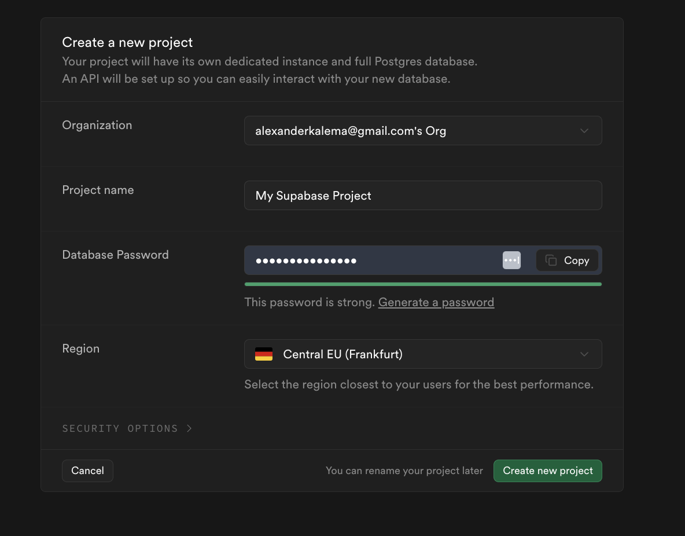
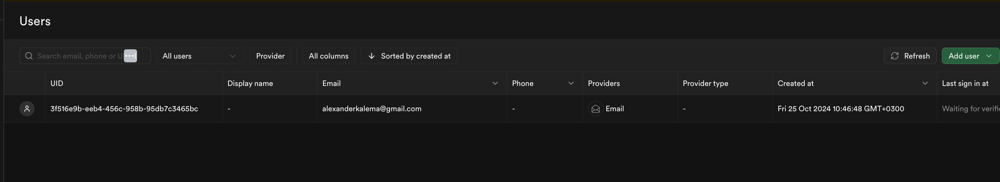

import Note from "@theme/Admonition";
import Admonition from "@theme/Admonition";
import Tabs from "@theme/Tabs";
import TabItem from "@theme/TabItem";

# How To Integrate Supabase in Flutter

Flutter has emerged as a popular framework for building cross-platform mobile applications. To enhance these applications with backend functionalities like authentication, database operations, and serverless functions, Supabase provides a robust solution. This guide will walk you through the integration process.

<Note title="Prerequisites">
- ✅ Basic knowledge of Flutter and Dart
- ✅ Flutter environment set up
- ✅ Supabase account ([Create one here](https://supabase.io))

</Note>


## Setting Up Your Supabase Project {#setup}

1. Create a new project in Supabase

2. Locate your project credentials: (you can find these two in your supabase project dashboard)
   - API URL
   - Anonymous Key

:::danger Project Credentials
Keep your project credentials secure. Never commit them directly to your source code.
:::


## Integrating Supabase in Flutter {#integration}

Add the required dependencies to your project by heading to pubspec.yaml and running <code>flutter pub get </code>:

```yaml
dependencies:
  flutter:
    sdk: flutter
  supabase_flutter: 2.8.0 
  flutter_dotenv: 5.2.1 

assets:
  - .env  
```
Create a `.env` file and setup the API URL and Anonoymus key. 
```yaml
SUPABASE_URL=your-url-here
SUPABASE_ANON_KEY=your-key-here
```

Lastly head to your `main.dart` and initalize your packages with these values:

```dart
import 'package:flutter/material.dart';
import 'package:flutter_dotenv/flutter_dotenv.dart';
import 'package:supabase_flutter/supabase_flutter.dart';

Future<void> main() async {
  await dotenv.load(fileName: ".env");
  Supabase.initialize(
    url: dotenv.env['SUPABASE_URL']!,
    anonKey: dotenv.env['SUPABASE_ANON_KEY']!,
  );
  runApp(MyApp());
}
```

## Authentication Implementation {#auth}

Supabase provides several authentication methods. Here are the most common ones:

<Tabs>
  <TabItem value="signup" label="Sign Up" default>
```dart
Future<void> signUpUser(String email, String password) async {
  try {
    final response = await Supabase.instance.client.auth.signUp(
      email: email,
      password: password,
    );
  } catch (error) {
    // Handle error
  }
}
```

  </TabItem>
  <TabItem value="signin" label="Sign In">
```dart
Future<void> signInUser(String email, String password) async {
  try {
    final response = await Supabase.instance.client.auth.signInWithPassword(
      email: email,
      password: password,
    );
  } catch (error) {
    // Handle error
  }
}
```
  </TabItem>
</Tabs>

Our Authentication screens would be simply setup as:
<details>
<summary><b>Welcome Screen - `main.dart`</b></summary>
```dart
import 'package:flutter/material.dart';
import 'package:flutter_dotenv/flutter_dotenv.dart';
import 'package:flutter_supabase/sign_in.dart';
import 'package:flutter_supabase/sign_up.dart';
import 'package:supabase_flutter/supabase_flutter.dart';

Future<void> main() async {
  await dotenv.load(fileName: ".env");
  Supabase.initialize(
    url: dotenv.env['SUPABASE_URL']!,
    anonKey: dotenv.env['SUPABASE_ANON_KEY']!,
  );
  runApp(MyApp());
}

class MyApp extends StatelessWidget {
  const MyApp({super.key});

  @override
  Widget build(BuildContext context) {
    return MaterialApp(
      title: 'Supabase Auth Demo',
      theme: ThemeData(
        colorScheme: ColorScheme.fromSeed(seedColor: Colors.deepPurple),
        useMaterial3: true,
      ),
      home: const WelcomeScreen(),
    );
  }
}

class WelcomeScreen extends StatelessWidget {
  const WelcomeScreen({super.key});

  @override
  Widget build(BuildContext context) {
    return Scaffold(
      body: SafeArea(
        child: Padding(
          padding: const EdgeInsets.symmetric(horizontal: 24.0),
          child: Column(
            mainAxisAlignment: MainAxisAlignment.center,
            crossAxisAlignment: CrossAxisAlignment.stretch,
            children: [
              const Icon(
                Icons.lock_outline,
                size: 100,
                color: Colors.deepPurple,
              ),
              const SizedBox(height: 48),
              const Text(
                'Welcome to\nSupabase Auth Demo',
                style: TextStyle(
                  fontSize: 32,
                  fontWeight: FontWeight.bold,
                ),
                textAlign: TextAlign.center,
              ),
              const SizedBox(height: 48),
              ElevatedButton(
                onPressed: () {
                  Navigator.push(
                    context,
                    MaterialPageRoute(builder: (context) => const SignInPage()),
                  );
                },
                style: ElevatedButton.styleFrom(
                  padding: const EdgeInsets.symmetric(vertical: 16),
                  backgroundColor: Colors.deepPurple,
                  foregroundColor: Colors.white,
                ),
                child: const Text(
                  'Sign In',
                  style: TextStyle(fontSize: 16),
                ),
              ),
              const SizedBox(height: 16),
              OutlinedButton(
                onPressed: () {
                  Navigator.push(
                    context,
                    MaterialPageRoute(builder: (context) => const SignUpPage()),
                  );
                },
                style: OutlinedButton.styleFrom(
                  padding: const EdgeInsets.symmetric(vertical: 16),
                  side: const BorderSide(color: Colors.deepPurple),
                  foregroundColor: Colors.deepPurple,
                ),
                child: const Text(
                  'Sign Up',
                  style: TextStyle(fontSize: 16),
                ),
              ),
            ],
          ),
        ),
      ),
    );
  }
}
```

</details>

<details>
<summary><b>Sign Up Screen - `sign_up.dart`</b></summary>
```dart
import 'package:flutter/material.dart';
import 'package:flutter_supabase/home.dart';
import 'package:supabase_flutter/supabase_flutter.dart';

class SignUpPage extends StatefulWidget {
  const SignUpPage({super.key});

  @override
  State<SignUpPage> createState() => _SignUpPageState();
}

class _SignUpPageState extends State<SignUpPage> {
  final _emailController = TextEditingController();
  final _passwordController = TextEditingController();
  final _formKey = GlobalKey<FormState>();
  bool _isLoading = false;

  Future<void> _signUp() async {
    if (_formKey.currentState!.validate()) {
      setState(() {
        _isLoading = true;
      });
      try {
        final response = await Supabase.instance.client.auth.signUp(
          email: _emailController.text.trim(),
          password: _passwordController.text.trim(),
        );
        if (response.user != null) {
          Navigator.pushReplacement(
            context,
            MaterialPageRoute(builder: (context) => const HomePage()),
          );
        } else {
          throw Exception('Sign-in failed. Please try again.');
        }
      } catch (error) {
        ScaffoldMessenger.of(context).showSnackBar(
          SnackBar(content: Text(error.toString())),
        );
      } finally {
        setState(() {
          _isLoading = false;
        });
      }
    }
  }

  @override
  Widget build(BuildContext context) {
    return Scaffold(
      appBar: AppBar(title: const Text('Sign Up')),
      body: Padding(
        padding: const EdgeInsets.all(16.0),
        child: Form(
          key: _formKey,
          child: Column(
            children: [
              TextFormField(
                controller: _emailController,
                decoration: const InputDecoration(labelText: 'Email'),
                validator: (value) =>
                value!.isEmpty ? 'Please enter email' : null,
              ),
              TextFormField(
                controller: _passwordController,
                decoration: const InputDecoration(labelText: 'Password'),
                obscureText: true,
                validator: (value) =>
                value!.isEmpty ? 'Please enter password' : null,
              ),
              const SizedBox(height: 20),
              ElevatedButton(
                onPressed: _isLoading ? null : _signUp,
                child: _isLoading
                    ? const CircularProgressIndicator()
                    : const Text('Sign Up'),
              ),
            ],
          ),
        ),
      ),
    );
  }
}

```

</details>

<details>
<summary><b>Sign in Screen - `sign_in.dart`</b></summary>
```dart
import 'package:flutter/material.dart';
import 'package:flutter_supabase/home.dart';
import 'package:supabase_flutter/supabase_flutter.dart';

class SignInPage extends StatefulWidget {
  const SignInPage({super.key});

  @override
  State<SignInPage> createState() => _SignInPageState();
}

class _SignInPageState extends State<SignInPage> {
  final _emailController = TextEditingController();
  final _passwordController = TextEditingController();
  final _formKey = GlobalKey<FormState>();
  bool _isLoading = false;

  Future<void> _signIn() async {
    if (_formKey.currentState!.validate()) {
      setState(() {
        _isLoading = true;
      });

      try {
        final response = await Supabase.instance.client.auth.signInWithPassword(
          email: _emailController.text.trim(),
          password: _passwordController.text.trim(),
        );
        if (response.user != null) {
          Navigator.pushReplacement(
            context,
            MaterialPageRoute(builder: (context) => const HomePage()),
          );
        } else {
          throw Exception('Sign-in failed. Please try again.');
        }

      } catch (error) {
        ScaffoldMessenger.of(context).showSnackBar(
          SnackBar(content: Text(error.toString())),
        );
      } finally {
        setState(() {
          _isLoading = false;
        });
      }
    }
  }

  @override
  Widget build(BuildContext context) {
    return Scaffold(
      appBar: AppBar(title: const Text('Sign In')),
      body: Padding(
        padding: const EdgeInsets.all(16.0),
        child: Form(
          key: _formKey,
          child: Column(
            children: [
              TextFormField(
                controller: _emailController,
                decoration: const InputDecoration(labelText: 'Email'),
                validator: (value) =>
                value!.isEmpty ? 'Please enter email' : null,
              ),
              TextFormField(
                controller: _passwordController,
                decoration: const InputDecoration(labelText: 'Password'),
                obscureText: true,
                validator: (value) =>
                value!.isEmpty ? 'Please enter password' : null,
              ),
              const SizedBox(height: 20),
              ElevatedButton(
                onPressed: _isLoading ? null : _signIn,
                child: _isLoading
                    ? const CircularProgressIndicator()
                    : const Text('Sign In'),
              ),
            ],
          ),
        ),
      ),
    );
  }
}
```
</details>
Go ahead sign up . You should see your user appear under the autnetication section in your supabase.




## Database Operations {#database}

Learn how to perform basic CRUD operations with Supabase:

<Tabs>
  <TabItem value="create" label="Create" default>

```dart
Future<void> addData() async {
    try {
      await Supabase.instance.client
          .from('your_table')
          .insert({
        'key': 'value',
      });
    } catch (error) {
      //  handle error
    }
  }
```

  </TabItem>
  <TabItem value="read" label="Read">

```dart

Future<void> _fetchData() async {

  try {
    final response = await Supabase.instance.client
        .from('your_table')
        .select();
  } catch (error) {
   // handle error
  } finally {
    setState(() {
      _isLoading = false;
    });
  }
}
```
  </TabItem>

  <TabItem value="update" label="Update">
```dart
// Update an item by its ID
Future<void> _updateItem(int id) async {
  try {
    await Supabase.instance.client
        .from('your_table')
        .update({
          'key': 'new-value',
        })
        .eq('id', id);
  } catch (error) {
    //handle error
  }
}
```
</TabItem> <TabItem value="delete" label="Delete">
```dart
// Delete an item by its ID
Future<void> _deleteItem(int id) async {
  try {
    await Supabase.instance.client
        .from('your_table')
        .delete()
        .eq('id', id);
  } catch (error) {
    // handle error
  }
}
```
</TabItem> 
</Tabs>

<details>
<summary><b>Home Screen - `home.dart`</b></summary>
```dart
import 'package:flutter/material.dart';
import 'package:flutter_supabase/main.dart';
import 'package:supabase_flutter/supabase_flutter.dart';

class HomePage extends StatefulWidget {
  const HomePage({super.key});

  @override
  State<HomePage> createState() => _HomePageState();
}

class _HomePageState extends State<HomePage> {
  final _user = Supabase.instance.client.auth.currentUser;
  List<Map<String, dynamic>> _data = [];
  bool _isLoading = false;

  @override
  void initState() {
    super.initState();
    _fetchData();
  }

  Future<void> _fetchData() async {
    setState(() {
      _isLoading = true;
    });

    try {
      final response = await Supabase.instance.client
          .from('items')
          .select();

      setState(() {
        _data = (response as List<dynamic>)
            .map((item) => item as Map<String, dynamic>)
            .toList();
      });
    } catch (error) {
      ScaffoldMessenger.of(context).showSnackBar(
        SnackBar(content: Text(error.toString())),
      );
    } finally {
      setState(() {
        _isLoading = false;
      });
    }
  }

  Future<void> _addItem(String title, String description) async {
    try {
      await Supabase.instance.client
          .from('items')
          .insert({
        'title': title,
        'description': description,
        'user_id': _user?.id, // Optional: associate item with user
      });

      // Refresh the list after adding a new item
      _fetchData();
    } catch (error) {
      print(error.toString());
      ScaffoldMessenger.of(context).showSnackBar(
        SnackBar(content: Text(error.toString())),
      );
    }
  }

  Future<void> _signOut() async {
    try {
      await Supabase.instance.client.auth.signOut();
      Navigator.of(context).pushAndRemoveUntil(
        MaterialPageRoute(builder: (context) => const WelcomeScreen()),
            (route) => false,
      );
    } catch (error) {
      ScaffoldMessenger.of(context).showSnackBar(
        SnackBar(content: Text(error.toString())),
      );
    }
  }

  void _showAddItemDialog() {
    final _titleController = TextEditingController();
    final _descriptionController = TextEditingController();

    showDialog(
      context: context,
      builder: (context) => AlertDialog(
        title: const Text('Add Item'),
        content: Column(
          mainAxisSize: MainAxisSize.min,
          children: [
            TextField(
              controller: _titleController,
              decoration: const InputDecoration(labelText: 'Title'),
            ),
            TextField(
              controller: _descriptionController,
              decoration: const InputDecoration(labelText: 'Description'),
            ),
          ],
        ),
        actions: [
          TextButton(
            onPressed: () => Navigator.pop(context),
            child: const Text('Cancel'),
          ),
          TextButton(
            onPressed: () {
              if (_titleController.text.isNotEmpty) {
                _addItem(
                  _titleController.text.trim(),
                  _descriptionController.text.trim(),
                );
                Navigator.pop(context);
              }
            },
            child: const Text('Add'),
          ),
        ],
      ),
    );
  }

  @override
  Widget build(BuildContext context) {
    return Scaffold(
      appBar: AppBar(
        title: Text('Home - ${_user?.email ?? "User"}'),
        actions: [
          IconButton(
            icon: const Icon(Icons.logout),
            onPressed: _signOut,
          ),
        ],
      ),
      floatingActionButton: FloatingActionButton(
        onPressed: _showAddItemDialog,
        child: const Icon(Icons.add),
      ),
      body: _isLoading
          ? const Center(child: CircularProgressIndicator())
          : _data.isEmpty
          ? const Center(child: Text('No items found'))
          : ListView.builder(
        itemCount: _data.length,
        itemBuilder: (context, index) {
          final item = _data[index];
          return Card(
            margin: const EdgeInsets.symmetric(
              horizontal: 8,
              vertical: 4,
            ),
            child: ListTile(
              title: Text(item['title'] ?? ''),
              subtitle: Text(item['description'] ?? ''),
              trailing: IconButton(
                icon: const Icon(Icons.delete),
                onPressed: () async {
                  try {
                    await Supabase.instance.client
                        .from('items')
                        .delete()
                        .match({'id': item['id']});
                    _fetchData();
                  } catch (error) {
                    ScaffoldMessenger.of(context).showSnackBar(
                      SnackBar(content: Text(error.toString())),
                    );
                  }
                },
              ),
            ),
          );
        },
      ),
    );
  }
}
```
</details>
:::important
Go to the `SQL Editor` inside your supabase and create this table by executing the below command for the home page to work.
```sql
-- Create the items table
CREATE TABLE IF NOT EXISTS items (
    id UUID DEFAULT gen_random_uuid() PRIMARY KEY,
    created_at TIMESTAMPTZ DEFAULT NOW(),
    title TEXT NOT NULL,
    description TEXT,
    user_id UUID REFERENCES auth.users(id)
);

-- Set up Row Level Security (RLS)
ALTER TABLE items ENABLE ROW LEVEL SECURITY;

-- Create policies
CREATE POLICY "Users can view their own items" ON items
    FOR SELECT USING (auth.uid() = user_id);

CREATE POLICY "Users can create their own items" ON items
    FOR INSERT WITH CHECK (auth.uid() = user_id);

CREATE POLICY "Users can update their own items" ON items
    FOR UPDATE USING (auth.uid() = user_id);

CREATE POLICY "Users can delete their own items" ON items
    FOR DELETE USING (auth.uid() = user_id);
```

:::


Finally you should be able to do: 


## Serverless Functions {#functions}

Implement serverless functionality using Supabase Functions:

```dart
Future<void> callFunction() async {
 try{
    final response = await Supabase.instance.client
      .rpc('function_name', params: {'param1': 'value'});
    } catch(e){
      // handle error
    }
  }
```

:::note
Remember to keep your Supabase client and dependencies updated to access the latest features and security updates.
:::

## Conclusion
Integrating Supabase with Flutter opens up a plethora of possibilities for developing feature-rich apps. By following this tutorial, you should now have a basic Flutter app integrated with Supabase for authentication, database operations, and serverless functions.

Remember to refer to the Supabase documentation for more detailed information and advanced features.