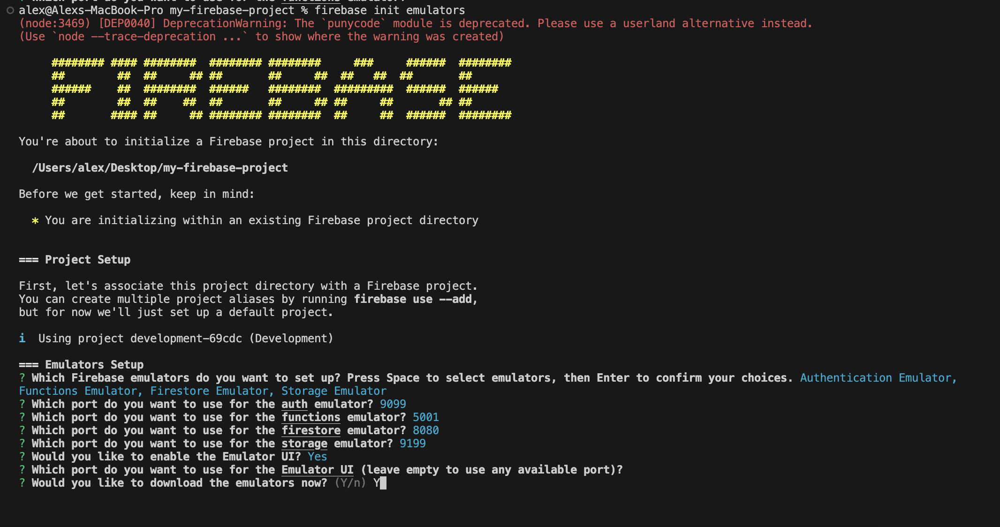
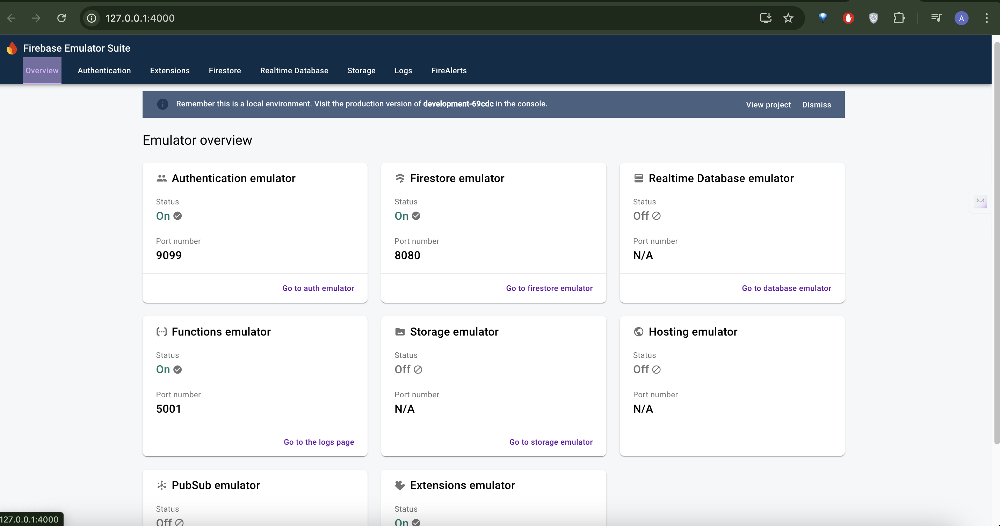
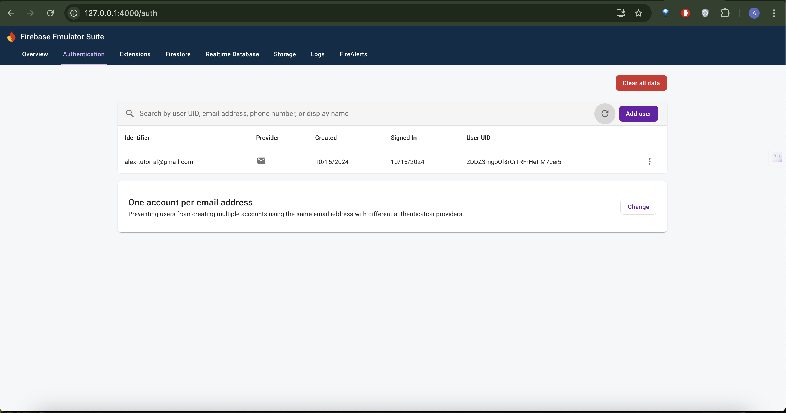

import Note from "@theme/Admonition";
import Tabs from "@theme/Tabs";
import TabItem from "@theme/TabItem";

# How to setup Firebase in localhost for testing

<Note type="important">
  You will need to setup your flutter and firebase project setup to continue. Check out previous tutorial to learn how to do so.
</Note>

## Set up Firebase locally for test

1. **Install the Firebase CLI**

If you haven't already installed the Firebase CLI, you can do so with the following command:

```sh 
npm install -g firebase-tools
```

2. **Log in to Firebase**

Log in to Firebase with your Google account:

```sh 
firebase login
```
3. **Navigate to your functions directory**

Change to your project directory where the `functions` folder in the firebase project and install the dependencies by running commands:

```sh
cd functions
npm install
```

## Initialize Firebase Emulators

Navigate back to the firebase root directory and initialize Firebase emulators by running:

```sh 
firebase init emulators
```

Follow the prompts to select which emulators you want to use (Functions, Firestore, Authentication, etc.). Next add Port configuration for the firebase emulators in the `firebase.json` file:



You should see the enabled firebase emulators in your `firebase.json` file.
:::tip
Add host value "0.0.0.0" to access it from your Ip Address. The final look of your `firebase.json` should look something like the below.
:::

```js
{
  "emulators": {
    "auth": {
      "host": "0.0.0.0",
      "port": 9099
    },
    "functions": {
      "host": "0.0.0.0",
      "port": 5001
    },
    "firestore": {
      "host": "0.0.0.0",
      "port": 8080
    },
    "ui": {
      "enabled": true
    },
    "singleProjectMode": true
  }
}
```

## Run Firebase Emulators

Run the following command to start the Firebase emulators:

```sh
firebase emulators:start
```

Check the terminal output to verify that the emulators are running. The output should specify which emulators are active and their respective ports. By following the provided Emulator UI link, you can access the Emulator UI, which displays all the enabled features.



## Configure Your Flutter App

In your main.dart file, add the following configurations after `await Firebase.initializeApp();`

```dart
FirebaseFirestore.instance.settings = const Settings(
  host: '<IP ADDRESS>:8080', // these ports should match the one in your firebase.json
  sslEnabled: false,
  persistenceEnabled: false,
);

FirebaseFunctions.instance.useFunctionsEmulator('<IP ADDRESS>', 5001);
FirebaseAuth.instance.useAuthEmulator('<IP ADDRESS>', 9099);
```

Replace `<IP ADDRESS>` with your actual IP address.

- Go ahead to our signup screen in your instaflutter app and add a user. You should see the user you added in your auth emulator as below:



## Conclusion

Congratulations! You've successfully set up Firebase for local testing with your Flutter app. This local setup allows you to:

- Test your app's Firebase functionality without affecting your production data
- Develop and debug faster with instant feedback
- Avoid incurring unnecessary costs during development

Remember to switch back to your production Firebase instance before deploying your app. Happy coding!

<Note type="tip">
  For more advanced Firebase emulator usage and best practices, check out the [official Firebase documentation](https://firebase.google.com/docs/emulator-suite).
</Note>