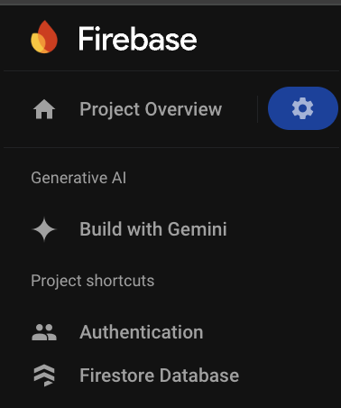
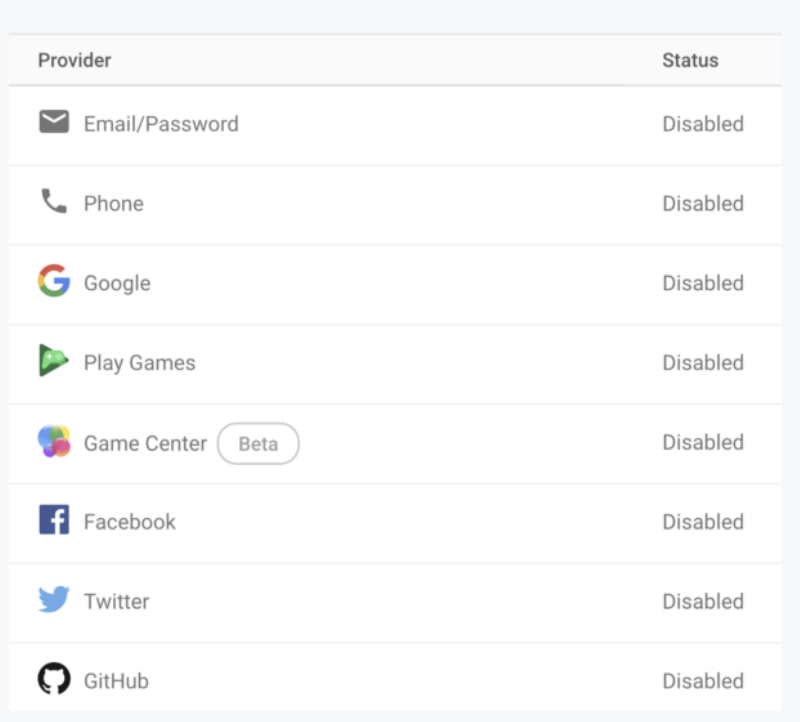
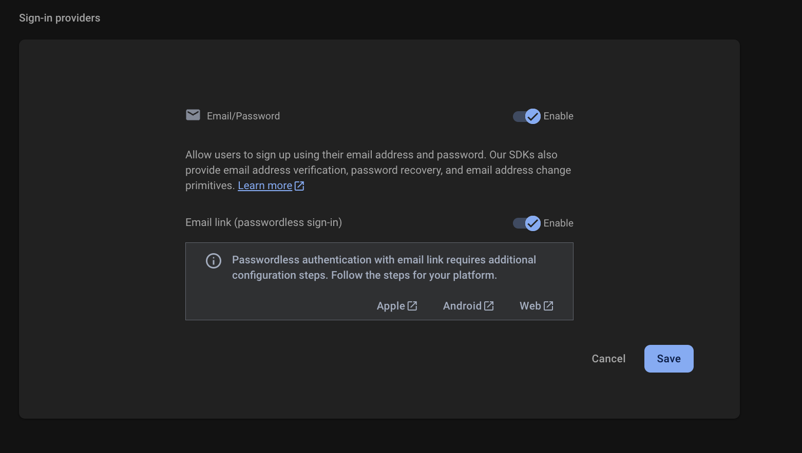
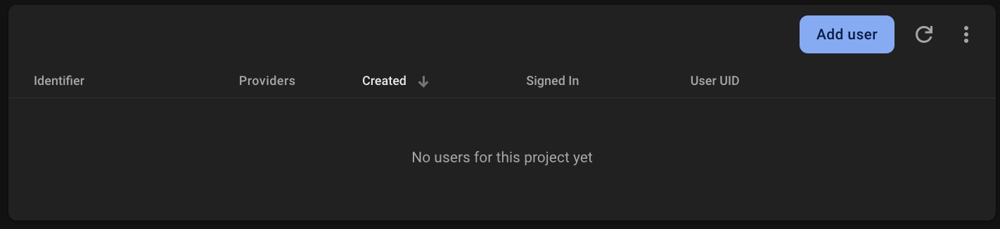
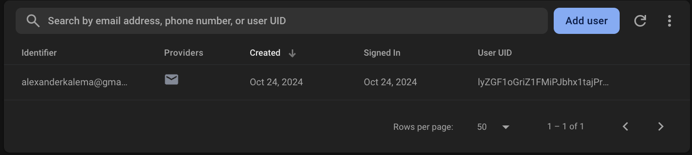

import Note from "@theme/Admonition";
import Admonition from "@theme/Admonition";

# Implementing Firebase Authentication in Flutter

Flutter is a wonderful framework for designing applications that can run on different platforms while using a single codebase. When Flutter is combined with Firebase, it becomes even more powerful. In this guide, we'll explore Firebase Authentication implementation using the Flutter Flutter plugin, focusing on two primary authentication methods:

- Encrypted email with passphrase
- Authentication via emailed links

:::note
While Firebase Authentication works with Flutter web apps, this guide primarily focuses on mobile application implementation.
:::

## Flutter App Setup

### Initial Setup

Before diving into Firebase Authentication implementation, let's establish our development environment. We'll use Android Studio with Android emulator for this tutorial.

1. First, ensure your Flutter environment is properly configured for Android Studio.
2. Create a basic Flutter project with the following structure:


### Adding Firebase Dependencies

After creating your Flutter app, you'll need to configure Firebase:

1. Follow the official Firebase documentation for initial setup
2. Add your SHA-1 key when registering your Android app (required for Email Link authentication)
3. Update your `pubspec.yaml` with the following dependencies:

```yaml
dependencies:
  firebase_auth: 5.3.1 
  firebase_core: 3.6.0
```

:::tip
You should add your application in firebase, check previous tutorial to see how to do so. Place your google-service.json file inside `android/app`. Then go to `android/settings.gradle` and add
```bash
id "com.google.gms.google-services" version "4.4.0" apply false
```
to the plugins block. Then go to `android/app/build.gradle` and add the below to the plugins block.
```bash
id "com.google.gms.google-services"
```

Finally, remember to run flutter pub get after updating your dependencies.
:::

## Implementation Guide

### Setting up the Authentication Screen

main.dart will house all of our code for registering new users and signing in already registered ones. To change the content of this file, you may do so as follows:

```dart
//1
import 'package:firebase_core/firebase_core.dart';
import 'package:flutter/material.dart';
import 'package:firebase_auth/firebase_auth.dart';

//2
final FirebaseAuth _auth = FirebaseAuth.instance;

void main() async {
  WidgetsFlutterBinding.ensureInitialized();
  await Firebase.initializeApp();
  runApp(const MyApp());
}

//3
class MyApp extends StatelessWidget {
  const MyApp({super.key});

  @override
  Widget build(BuildContext context) {
    return const MaterialApp(
      title: 'Firebase Auth Demo',
      home: MyHomePage(title: 'Firebase Auth Demo'),
    );
  }
}

class MyHomePage extends StatefulWidget {
  const MyHomePage({super.key, required this.title});

  final String title;

  @override
  State<MyHomePage> createState() => _MyHomePageState();
}

class _MyHomePageState extends State<MyHomePage> {
  //4
  @override
  Widget build(BuildContext context) {
    return Scaffold(
      appBar: AppBar(
        title: Text(widget.title),
        actions: <Widget>[
          Builder(builder: (BuildContext context) {
            //5
            return TextButton(
              onPressed: () async {
                final User? user = _auth.currentUser;
                if (user == null) {
                  //6
                  ScaffoldMessenger.of(context).showSnackBar(const SnackBar(
                    content: Text('No one has signed in.'),
                  ));
                  return;
                }
                await _auth.signOut();
                final String uid = user.uid;
                ScaffoldMessenger.of(context).showSnackBar(SnackBar(
                  content: Text('$uid has successfully signed out.'),
                ));
              },
              child: const Text('Sign out', style: TextStyle(color: Colors.white)),
            );
          })
        ],
      ),
      body: Builder(builder: (BuildContext context) {
        //7
        return ListView(
          scrollDirection: Axis.vertical,
          padding: const EdgeInsets.all(16),
          children: <Widget>[
            // TODO: UI widgets will go here.
          ],
        );
      }),
    );
  }
}
```

Let’s take a closer look at what’s going on in this situation. For the most part, we’ll be relying on the imports listed first in class (1).

- Widgets with Material-based views are created using the material.

- Firebase Authentication is built on the foundation of firebase auth.


A `FirebaseAuth` object instance may be found below the imports (2). The Firebase backend and your app will communicate with each other using this to keep track of your app’s users. `State<HomePage>` construct (4) function is more intriguing than the two blocks (3), <span style={{color: 'red'}}> MyApp </span> and <span style={{color: 'red'}}> MyHomePage </span>, which are both conventional Flutter structures. A user may sign out by clicking the sign-out button on the AppBar, which has just one TextButton (5) on it. When the user touches the button, a `Snackbar` (6) message will appear to inform the user that they are not presently authorized.

In the <span style={{color: 'red'}}> ListView </span>(7) which serves as the last stage of the building process, each section of this article will be represented by a different widget in the form of an array.

### Email and Password Authentication

Regarding our illustrative app, we are at last prepared to go on to the more exciting parts. To get started using the Firebase Console, go to the left navigation pane and choose the Authentication tab.



Select the Sign-in Methods to tab from the Authentication page.


There are a lot of different ways to sign in to your Firebase account, and we’ll be coming to this page a lot in this tutorial.




Please enable email/password synchronization for the time being. toggle for an email link may also be found (passwordless sign-in). Passwordless sign-in is the next sort of authentication we’ll learn about, so go ahead and turn it on. You may save your progress by clicking the blue save button while both of those toggles are active.



The Users tab is now empty, as may be seen by returning there. Let’s go ahead and make that modification now.


#### Creating an account using an email address and password
Open the main Dart file in Android Studio once again. To sign up for Firebase, we’ll be adding a form to this file that will ask users for their email addresses and password. In order to begin, you may add these classes:

```dart
class _RegisterEmailSection extends StatefulWidget {
  final String title = 'Registration';
  @override
  State<StatefulWidget> createState() => 
      _RegisterEmailSectionState();
}
class _RegisterEmailSectionState extends State<_RegisterEmailSection> {
@override
  Widget build(BuildContext context) {
    //TODO UI content here
  }
}
```
The _RegisterEmailSectionState class will handle the remainder of the registration process. Add the following code to the class’s head:

```dart
final GlobalKey<FormState> _formKey = GlobalKey<FormState>();
final TextEditingController _emailController = TextEditingController();
final TextEditingController _passwordController = TextEditingController();
bool? _success;
String? _userEmail;
```
In order to verify that the user has input the correct email address and password, the `GlobalKeyFormState` object is utilized, as are both TextEditingControllers. For the purposes of this screen, the values of the attributes _success and _userEmail will be utilized to monitor the current status.

The registration UI is the next phase in this example app’s development. You may just replace the whole build procedure with the following code, which is not directly connected to Firebase authentication:

```dart
  @override
  Widget build(BuildContext context) {
    return Container(
      constraints: BoxConstraints(minHeight: 0, maxHeight: MediaQuery.of(context).size.height),
      child: SingleChildScrollView(
        child: Form(
          key: _formKey,
          child: Column(
            crossAxisAlignment: CrossAxisAlignment.start,
            children: <Widget>[
              TextFormField(
                controller: _emailController,
                decoration: const InputDecoration(labelText: 'Email'),
                validator: (String? value) {
                  if (value == null || value.isEmpty) {
                    return 'Please enter some text';
                  }
                  return null;
                },
              ),
              TextFormField(
                controller: _passwordController,
                decoration: const InputDecoration(labelText: 'Password'),
                obscureText: true,
                validator: (String? value) {
                  if (value == null || value.isEmpty) {
                    return 'Please enter some text';
                  }
                  return null;
                },
              ),
              Container(
                padding: const EdgeInsets.symmetric(vertical: 16.0),
                alignment: Alignment.center,
                child: ElevatedButton(
                  onPressed: () async {
                    if (_formKey.currentState!.validate()) {
                      await _register();
                    }
                  },
                  child: const Text('Submit'),
                ),
              ),
              Container(
                alignment: Alignment.center,
                child: Text(_success == null
                    ? ''
                    : (_success!
                    ? 'Successfully registered $_userEmail'
                    : 'Registration failed')),
              ),
            ],
          ),
        ),
      ),
    );
  }
```


A Firebase account was created with only a single call to createUserWithEmailAndPassword(). In this class, we’ll add a method for cleaning up some of our components when the program is put into the background or closed by the user.
```dart
@override
void dispose() {
  _emailController.dispose();
  _passwordController.dispose();
  super.dispose();
}
```

Finally, we’ll put our newly constructed widget on display. Replace the note /TODO: UI widgets will go here in the build function of _MyHomePageState with _RegisterEmailSection in the ListView (),.

It’s time to start our app now that the registration page has been completed. Upon launching the app, you should be greeted with two new text boxes. Please enter your email address and password. Once you’ve pressed the submit button, you should get a confirmation message telling you that your email address has been registered successfully.


If you go back to the Authentication page and click on the Users tab, you should now be able to view the email in the Firebase Console.




## Conclusion
Congratulations! Your Flutter app has successfully merged with Firebase Authentication. In addition to providing the underlying infrastructure for user authentication, the specified methods of auto-login and email verification are provided by Firebase Authentication. Firebase Authentication may also be integrated with a variety of identity providers, such as Google, Facebook, Twitter, and Apple, among many others.